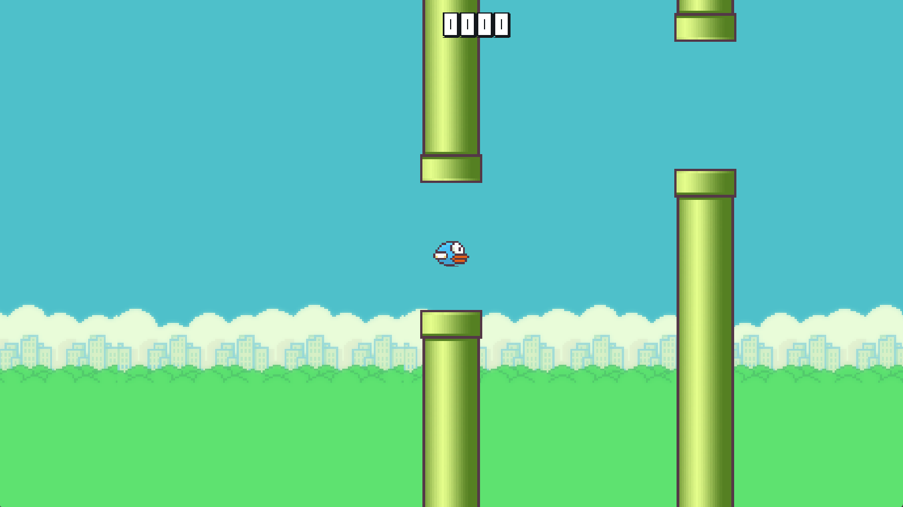
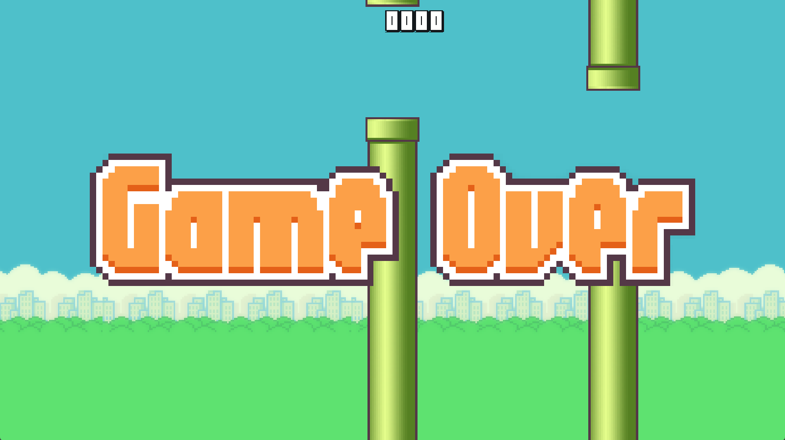

# FlappyBird

This is a classic game that is recreated in java using the LWJGL library.  

## Game Screens:

## About the game

This game is made using OpenGL 4.6 and uses the newer API like the DSA(Direct State Access)
for creating the buffer and texture objects. Also uses GLFW for window creation and input, PNGDecoder
for reading PNG files.

